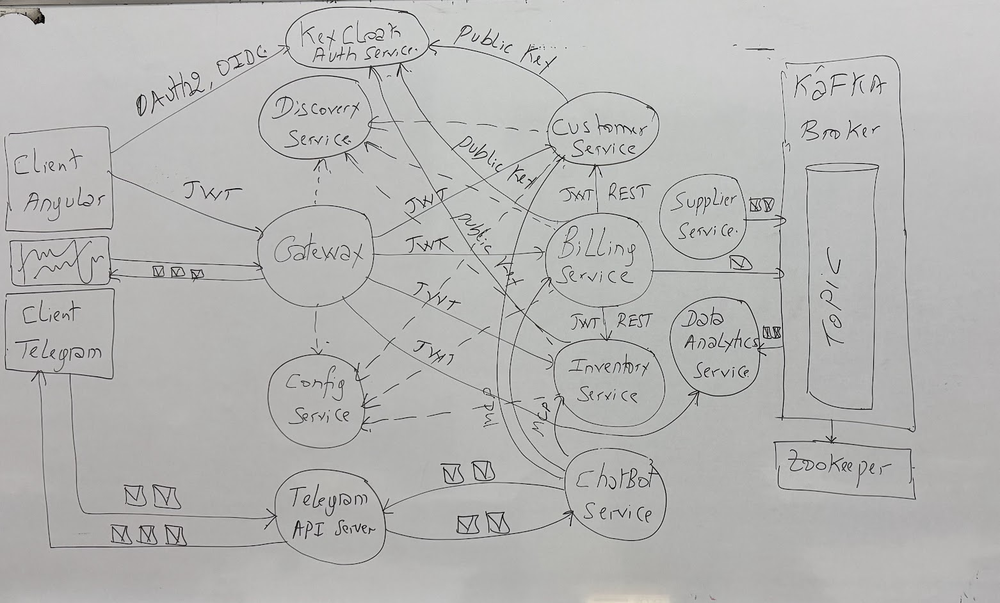
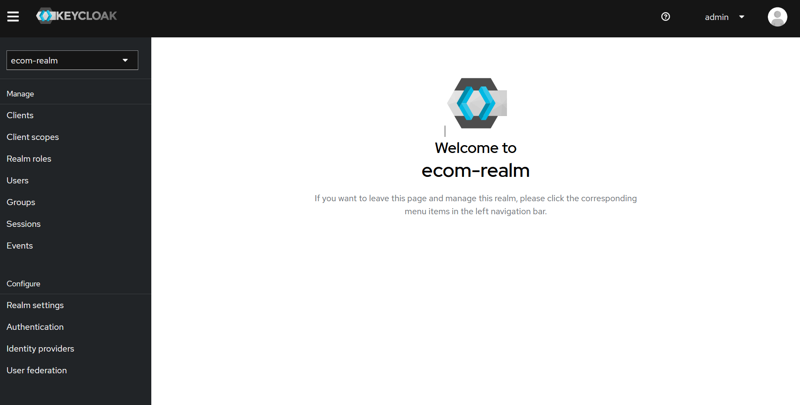
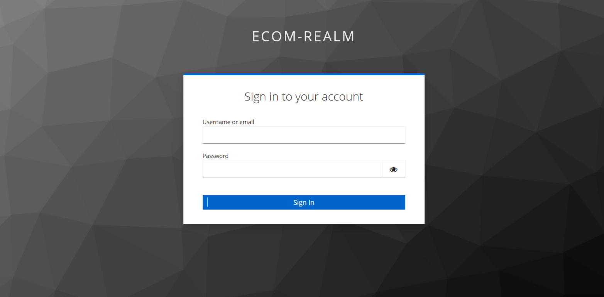

# E-Commerce Microservices Platform

A complete microservices-based e-commerce system built with Spring Boot, Spring Cloud, KeyCloak, Kafka, and Angular.

## Architecture Overview

The platform follows a modern microservices architecture with service discovery, centralized configuration, API gateway, event-driven communication, and OAuth2 authentication.

## Tech Stack

- **Backend**: Spring Boot 3.x, Spring Cloud
- **Authentication**: KeyCloak (OAuth2/OIDC)
- **Service Discovery**: Eureka  
- **API Gateway**: Spring Cloud Gateway
- **Event Streaming**: Apache Kafka
- **Frontend**: Angular 19
- **AI Integration**: Telegram Bot with RAG (Retrieval-Augmented Generation)
- **Databases**: H2 (dev), PostgreSQL-ready

---

## Services

### Infrastructure Services

**Discovery Service (Eureka)** - Port 8761  
Service registry where all microservices register themselves for dynamic discovery.

**Config Service** - Port 9999  
Centralized configuration management using Git repository.

**Gateway Service** - Port 8888  
API Gateway with JWT validation and intelligent routing to microservices.

### Business Services

**Customer Service** - Port 8081  
Manages customer data with REST API and H2 database.

**Inventory Service** - Port 8082  
Product catalog management with CRUD operations.

**Billing Service** - Port 8083  
Invoice generation consuming data from Customer and Inventory services. Publishes billing events to Kafka.

**Kafka Analytics Service** - Port 8085  
Event processing service with:
- Supplier management API
- Data analytics dashboard
- Kafka consumers for billing and supplier events

### AI & Bot Services

**Agent Bot** - Port 8087  
Telegram bot with RAG capabilities for document-based Q&A using OpenAI and Spring AI.

**MCP Server** - Port 8989  
Exposes microservices tools via Model Context Protocol for AI agent integration.

---

## Authentication

KeyCloak manages authentication with realm-based multi-tenancy and role-based access control.

---

## Frontend

Angular 19 application with:
- Customer management
- Product catalog
- Billing dashboard
- KeyCloak integration (login/logout)

---

## Monitoring

Actuator endpoints provide health checks and metrics for all services.

---

## API Endpoints

| Service | Base URL |
|---------|----------|
| Gateway | http://localhost:8888 |
| Customers | http://localhost:8888/CUSTOMER-SERVICE/api/customers |
| Products | http://localhost:8888/INVENTORY-SERVICE/api/products |
| Bills | http://localhost:8888/BILLING-SERVICE/api/bills |
| Suppliers | http://localhost:8085/api/suppliers |
| Analytics | http://localhost:8085/api/analytics |

---

## Event Streaming

Services communicate asynchronously via Kafka topics:
- `BILLING_EVENTS` - Published by Billing Service
- `SUPPLIER_EVENTS` - Published by Supplier Service  
- Consumed by Analytics Service for real-time reporting

